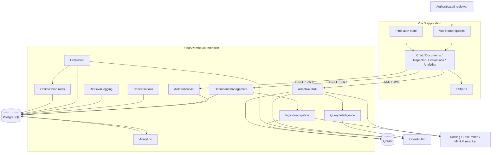
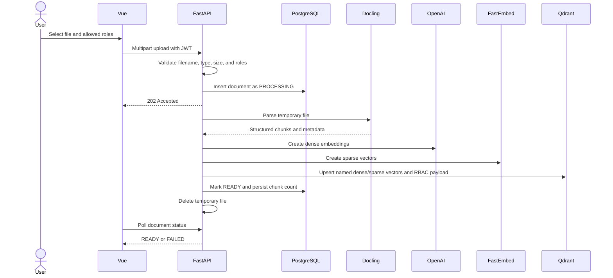
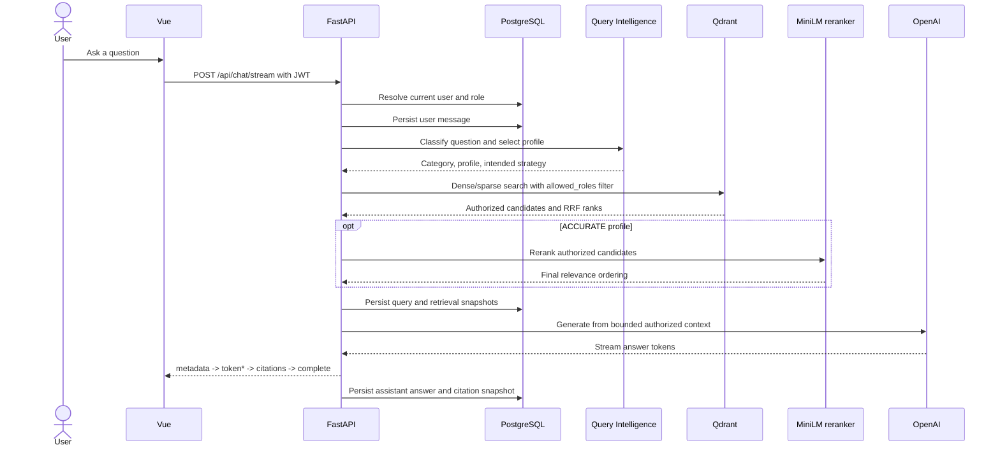
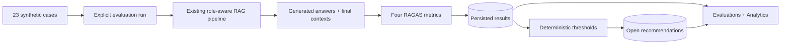
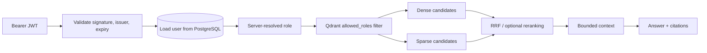
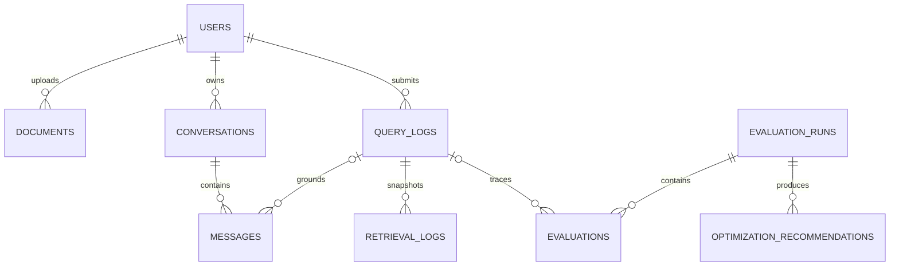
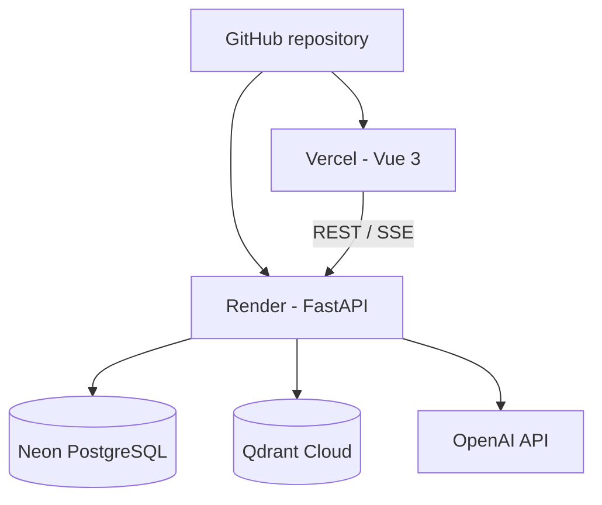

# Enterprise Knowledge Intelligence Platform

<div align="center">
  <strong>Role-aware adaptive RAG with observable retrieval, explicit evaluation, and deterministic optimization.</strong>
</div>

<br />

EKIP turns internal PDF, DOCX, PPTX, and Markdown documents into grounded answers with inspectable
citations. It is designed around a difficult enterprise requirement: retrieval quality must improve
without allowing restricted content to enter the candidate set, prompt, answer, citation, logs, or
analytics.

This repository contains a complete MVP through Phase 13 of
[`PROJECT_SPEC.md`](PROJECT_SPEC.md). The application runs locally with Vue 3, FastAPI, PostgreSQL,
Qdrant, OpenAI, Docling, FastEmbed, a local MiniLM reranker, and RAGAS. See the
[Oracle Cloud deployment guide](docs/deployment-oracle.md) for the prepared ARM64 backend release
workflow; the guide does not provision or deploy infrastructure.

## At A Glance

| Capability     | Implementation                                                                |
| -------------- | ----------------------------------------------------------------------------- |
| Authorization  | JWT identity plus server-resolved Developer, HR, Finance, and Executive roles |
| Ingestion      | Docling parsing, token-aware chunking, dense and sparse vectors               |
| Retrieval      | Adaptive FAST, BALANCED, and ACCURATE profiles                                |
| Search         | Dense similarity, BM25-style sparse retrieval, native Qdrant RRF              |
| Ranking        | Local `Xenova/ms-marco-MiniLM-L-6-v2` cross-encoder for ACCURATE queries      |
| Grounding      | Bounded authorized context, citations, insufficient-context behavior          |
| Conversations  | PostgreSQL persistence with SSE answer streaming                              |
| Explainability | User-scoped Retrieval Inspector with immutable candidate snapshots            |
| Evaluation     | Explicit RAGAS runs over 23 checked-in synthetic cases                        |
| Optimization   | Persisted rule-based recommendations that never auto-apply                    |
| Analytics      | Aggregate quality, latency, strategy, and recommendation dashboard            |
| Verification   | 140 backend tests and 45 frontend tests passing                               |

## Contents

- [Why EKIP Exists](#why-ekip-exists)
- [Core Differentiators](#core-differentiators)
- [System Architecture](#system-architecture)
- [End-to-End Flows](#end-to-end-flows)
- [Security Model](#security-model)
- [Retrieval Profiles](#retrieval-profiles)
- [Product Experience](#product-experience)
- [Data Model](#data-model)
- [Technology Stack](#technology-stack)
- [Repository Structure](#repository-structure)
- [Quick Start](#quick-start)
- [Demo Walkthrough](#demo-walkthrough)
- [Configuration](#configuration)
- [API Reference](#api-reference)
- [Evaluation and Optimization](#evaluation-and-optimization)
- [Analytics](#analytics)
- [Testing and Quality](#testing-and-quality)
- [Operational Notes](#operational-notes)
- [Deployment Target](#deployment-target)
- [Design Decisions](#design-decisions)
- [Scope Boundaries](#scope-boundaries)

## Why EKIP Exists

Basic RAG demos usually answer one question with one vector search. Enterprise knowledge systems
have harder constraints:

- Different users must see different documents.
- Exact policy identifiers and semantic questions require different retrieval behavior.
- A plausible answer is not enough; reviewers need source evidence.
- Retrieval decisions must be inspectable after the request completes.
- Quality needs repeatable measurement instead of anecdotal prompt testing.
- Optimization advice should be explainable and reversible.
- The architecture must work locally without blocking a later cloud deployment.

EKIP addresses those constraints as one coherent application rather than a collection of isolated
AI experiments.

## Core Differentiators

### Authorization happens inside retrieval

The backend derives the user's role from a validated JWT and database record. That role becomes a
Qdrant `allowed_roles` payload filter on every dense and sparse prefetch. Restricted chunks are
removed before fusion, reranking, context construction, answer generation, and citations.

### Retrieval adapts to the question

Query Intelligence classifies the request and selects a centralized retrieval profile. A simple
FAQ does not pay the latency cost of sparse fusion and cross-encoder reranking, while comparison and
summary questions can use the complete retrieval path.

### Retrieval is observable, not opaque

Each query persists the category, profile, actual execution strategy, fallback state, latency, and
candidate snapshots. The Inspector shows available dense, RRF, and reranker scores, ranks before
and after reranking, dropped candidates, and final context inclusion.

### Evaluation is explicit and reproducible

RAGAS evaluation is an authenticated, deliberate workflow over versioned synthetic data. It never
runs implicitly during normal chat, keeping user latency and API cost predictable.

### Optimization stays deterministic

Fixed thresholds turn completed evaluation evidence into persisted recommendations. The system
never silently changes retrieval profiles, Top-K values, environment variables, or infrastructure.

## System Architecture



### Why a modular monolith

The backend has explicit module boundaries for authentication, documents, ingestion, retrieval,
conversations, inspection, evaluation, optimization, and analytics, but it deploys as one FastAPI
service. This preserves clear ownership and testability without introducing queues, service
discovery, distributed transactions, or operational overhead that the MVP does not need.

### Runtime responsibilities

| Component    | Responsibility                                                                       |
| ------------ | ------------------------------------------------------------------------------------ |
| Vue 3        | Authenticated workflows, streaming UI, Inspector, evaluation, analytics              |
| FastAPI      | Trust boundary, orchestration, validation, API and SSE contracts                     |
| PostgreSQL   | Users, documents, conversations, messages, query facts, evaluation, recommendations  |
| Qdrant       | Named dense/sparse vectors, payload metadata, pre-retrieval RBAC filtering           |
| OpenAI       | Dense embeddings, Query Intelligence, grounded answer generation, RAGAS judge models |
| Docling      | Structured parsing for PDF, DOCX, PPTX, and Markdown                                 |
| FastEmbed    | Sparse document and query representations                                            |
| MiniLM reranker | Local cross-encoder reranking for ACCURATE requests                               |
| RAGAS        | Faithfulness, Answer Relevancy, Context Precision, Context Recall                    |

## End-to-End Flows

### Document ingestion



Every Qdrant point contains:

```text
document_id
chunk_id
filename
page
section
chunk_index
text
chunk_hash
allowed_roles
```

Uploads never depend on permanent local server storage. The temporary file is removed after success
or failure, which keeps the ingestion design compatible with ephemeral cloud filesystems.

### Authenticated RAG query



Retrieval latency covers query representations and retrieval, plus reranking for ACCURATE queries.
The current question always performs new retrieval. Recent conversation messages help generation
but are never treated as authoritative document evidence.

### Evaluation and optimization loop



## Security Model

The frontend is not a trust boundary. It may hold a JWT, but it never supplies a trusted role,
retrieval strategy, allowed document list, or evaluation identity.



| Control              | Enforcement                                                             |
| -------------------- | ----------------------------------------------------------------------- |
| Identity             | Signed JWT plus current database user lookup                            |
| Role                 | Read from the server-side user record, never request JSON               |
| Vector authorization | Qdrant filter before dense/sparse candidate selection                   |
| Conversations        | Every read/delete operation is scoped to `current_user.id`              |
| Inspector            | Missing and other-user query IDs return the same safe `404`             |
| Evaluation           | Each case uses its seeded role identity and the normal RAG path         |
| Analytics            | Aggregate data only; no raw query, conversation, or document content    |
| Passwords            | Argon2 hashing through `pwdlib`; plaintext is never persisted or logged |
| Secrets              | Environment variables; `.env` is ignored and `.env.example` is safe     |

## Retrieval Profiles

| Profile  | Typical categories               | Executed strategy   | Candidate limit | Final limit |
| -------- | -------------------------------- | ------------------- | --------------- | ----------- |
| FAST     | FAQ                              | `DENSE`             | 3               | Up to 3     |
| BALANCED | Specific search, restricted data | `HYBRID_RRF`        | 8               | Up to 8     |
| ACCURATE | Comparison, summarization        | `HYBRID_RRF_RERANK` | 15              | Up to 5     |

Top-K values are maximums. Score filtering or the number of authorized indexed chunks may produce
fewer candidates.

### Dense retrieval

OpenAI `text-embedding-3-small` vectors capture semantic similarity and work well for natural-language
questions where the wording differs from the source.

### Sparse retrieval

FastEmbed sparse vectors preserve exact identifiers, policy codes, names, and terms that dense
retrieval may underweight.

### Reciprocal Rank Fusion

Qdrant-native RRF combines dense and sparse rankings without pretending their raw scores are on the
same scale. This gives BALANCED and ACCURATE queries semantic coverage plus exact-term recall.

### Cross-encoder reranking

ACCURATE retrieves a broader authorized pool, then `Xenova/ms-marco-MiniLM-L-6-v2` scores each
question/chunk pair. Only the highest-ranked bounded chunks reach answer generation.

## Product Experience

| Route          | Purpose                                                                     |
| -------------- | --------------------------------------------------------------------------- |
| `/login`       | Demo authentication with clear failure handling                             |
| `/`            | FastAPI, PostgreSQL, and Qdrant health status                               |
| `/chat`        | Streaming grounded chat, conversations, routing metadata, citations         |
| `/documents`   | Upload, role assignment, processing status, errors, owner deletion          |
| `/inspector`   | Query-level strategy, latency, candidates, ranks, scores, context inclusion |
| `/evaluations` | Start runs, follow progress, inspect cases, metrics, and recommendations    |
| `/analytics`   | Aggregate quality, retrieval strategy, latency, and optimization trends     |

### SSE event contract

`POST /api/chat/stream` returns standard `text/event-stream` data in a fixed order:

```text
metadata
token
token
...
citations
complete
```

If processing fails after streaming starts, the backend emits a safe `error` event. The client uses
`fetch` plus `ReadableStream` because the request is an authenticated `POST`; native `EventSource`
cannot provide that request shape.

### Citation integrity

Citations are generated only from final authorized chunks actually supplied to the model. Each
assistant message stores a JSON citation snapshot, so sources remain visible after refresh and can
survive later document deletion.

## Data Model



| PostgreSQL entity              | Important persisted facts                                               |
| ------------------------------ | ----------------------------------------------------------------------- |
| `users`                        | Email, password hash, role                                              |
| `documents`                    | Hash, uploader, roles, status, chunk count, safe error                  |
| `conversations`                | Owner, title, timestamps                                                |
| `messages`                     | Role, content, query link, citation snapshot, insufficient-context flag |
| `query_logs`                   | Query, category, profile, actual strategy, fallback, latency            |
| `retrieval_logs`               | Source snapshot, scores, ranks, context inclusion                       |
| `evaluation_runs`              | Status, progress, timestamps, run-level failure                         |
| `evaluations`                  | Expected/generated answers, four metrics, case failure details          |
| `optimization_recommendations` | Metric, value, threshold, profile, strategy, status                     |

Qdrant stores document chunks and retrieval vectors. PostgreSQL stores business state, immutable
inspection evidence, evaluation results, and analytics sources. Analytics is computed from existing
tables; no duplicate analytics database or table is required.

## Technology Stack

| Layer            | Technology                                                      |
| ---------------- | --------------------------------------------------------------- |
| Frontend         | Vue 3, TypeScript, Pinia, Vue Router, Tailwind CSS 4, ECharts 6 |
| Frontend quality | Vitest, Vue Test Utils, ESLint, Prettier, vue-tsc               |
| Backend          | Python 3.11+, FastAPI, Pydantic 2, SQLAlchemy async, asyncpg    |
| Backend quality  | pytest, pytest-asyncio, Ruff, mypy                              |
| Relational data  | PostgreSQL 16, Alembic                                          |
| Vector data      | Qdrant with named dense and sparse vectors                      |
| AI               | OpenAI API, Docling, FastEmbed, MiniLM reranker                 |
| Evaluation       | RAGAS 0.4                                                       |
| Local runtime    | Docker Compose, Uvicorn, Vite                                   |

## Repository Structure

```text
.
|-- backend/
|   |-- app/
|   |   |-- analytics/          # Aggregate dashboard queries and response models
|   |   |-- api/                # Health API
|   |   |-- auth/               # Users, JWTs, password hashing, auth dependencies
|   |   |-- conversations/      # Owner-scoped threads and persisted messages
|   |   |-- documents/          # Upload/list/delete APIs and document state
|   |   |-- evaluations/        # Dataset execution and RAGAS persistence
|   |   |-- ingestion/          # Docling, chunking, embeddings, Qdrant indexing
|   |   |-- optimization/       # Deterministic recommendation rules
|   |   |-- query_intelligence/ # Classification, profiles, logs, Inspector APIs
|   |   `-- rag/                # Retrieval, reranking, prompting, generation, SSE
|   |-- migrations/             # Complete Alembic schema history
|   |-- scripts/                # Demo seed, evaluation seed, recommendation generation
|   `-- tests/                  # Focused unit/API/integration/security coverage
|-- evaluation/
|   |-- dataset.json            # 23 versioned synthetic evaluation cases
|   `-- documents/              # Five synthetic source policies
|-- frontend/
|   `-- src/
|       |-- analytics/          # Testable ECharts option mapping
|       |-- api/                # Typed REST/SSE clients
|       |-- components/         # Shared application and chart components
|       |-- pages/              # Login, Chat, Documents, Inspector, Evaluations, Analytics
|       |-- router/             # Protected routes
|       |-- stores/             # Pinia authentication state
|       `-- styles/             # Tailwind theme and shared component styles
|-- docker-compose.yml          # Local PostgreSQL and Qdrant
|-- .env.example                # Safe configuration template
|-- PROJECT_SPEC.md             # Product and implementation source of truth
`-- README.md
```

## Quick Start

### Prerequisites

- Python 3.11 or newer
- Node.js 22 or newer
- Docker Desktop with Docker Compose
- A valid OpenAI API key

### 1. Configure the environment

From the repository root:

```powershell
Copy-Item .env.example .env
```

Set `OPENAI_API_KEY` in `.env`. The remaining defaults are intended for local development.

### 2. Start PostgreSQL and Qdrant

```powershell
docker compose up -d
docker compose ps
```

Both containers should report `healthy`.

### 3. Set up the backend

```powershell
cd backend
python -m venv .venv
.\.venv\Scripts\Activate.ps1
python -m pip install --upgrade pip
python -m pip install -r requirements-dev.txt
python -m alembic upgrade head
python -m scripts.seed_demo
python -m scripts.seed_evaluation_data
python -m uvicorn app.main:app --reload
```

On Linux or macOS, activate the environment with `source .venv/bin/activate`.

### 4. Start the frontend

In a second terminal:

```powershell
cd frontend
npm install
npm run dev
```

### 5. Open the application

| Service          | URL                               |
| ---------------- | --------------------------------- |
| Vue application  | `http://localhost:5173`           |
| FastAPI          | `http://localhost:8000`           |
| OpenAPI          | `http://localhost:8000/docs`      |
| Health           | `http://localhost:8000/health`    |
| Qdrant dashboard | `http://localhost:6333/dashboard` |

## Demo Walkthrough

A complete reviewer flow takes the application through its major trust and quality boundaries:

1. Sign in as `hr@demo.com`.
2. Upload a small document from `/documents` and restrict it to HR.
3. Wait for `PROCESSING` to become `READY`; confirm the chunk count appears.
4. Ask an FAQ in `/chat`; observe FAST and dense retrieval metadata.
5. Ask for an exact policy identifier; observe BALANCED and hybrid RRF.
6. Ask for a comparison or summary; observe ACCURATE and MiniLM reranking.
7. Open citations and reopen the conversation after refreshing the page.
8. Open `/inspector` and compare candidate ranks, scores, and final-context inclusion.
9. Sign out and sign in as `developer@demo.com`; confirm the HR-only content is not retrievable.
10. Open `/evaluations`, run the representative five-case evaluation, and inspect case metrics.
11. Review deterministic recommendations without applying any automatic change.
12. Open `/analytics` to view strategy usage, latency, evaluation quality, and recommendations.

### Demo accounts

| Email                | Role      |
| -------------------- | --------- |
| `developer@demo.com` | Developer |
| `hr@demo.com`        | HR        |
| `finance@demo.com`   | Finance   |
| `executive@demo.com` | Executive |

All four accounts use the password configured by `DEMO_USER_PASSWORD`. The checked-in example,
`ekip_demo_password`, is for local demonstration only and must not be reused outside local
development.

## Configuration

`.env.example` is the complete configuration contract. `.env` is ignored by Git.

| Variable                      | Purpose                                    | Local default/example    |
| ----------------------------- | ------------------------------------------ | ------------------------ |
| `APP_ENV`                     | Runtime environment label                  | `development`            |
| `DATABASE_URL`                | Async SQLAlchemy PostgreSQL connection     | Local PostgreSQL URL     |
| `QDRANT_URL`                  | Qdrant HTTP endpoint                       | `http://localhost:6333`  |
| `QDRANT_API_KEY`              | Optional Qdrant authentication             | Blank locally            |
| `QDRANT_DOCUMENTS_COLLECTION` | Chunk collection name                      | `ekip_documents`         |
| `OPENAI_API_KEY`              | OpenAI authentication                      | Blank; required locally  |
| `OPENAI_CHAT_MODEL`           | Classification and generation model        | `gpt-4.1-mini`           |
| `OPENAI_EMBEDDING_MODEL`      | Dense embedding model                      | `text-embedding-3-small` |
| `OPENAI_EMBEDDING_DIMENSIONS` | Dense vector size                          | `1536`                   |
| `RERANKER_MODEL`              | Local cross-encoder             | `Xenova/ms-marco-MiniLM-L-6-v2` |
| `RAGAS_LLM_MODEL`             | RAGAS judge model                          | `gpt-4.1-mini`           |
| `RAGAS_EMBEDDING_MODEL`       | RAGAS relevancy embeddings                 | `text-embedding-3-small` |
| `JWT_SECRET`                  | HMAC signing secret, minimum 32 characters | Safe placeholder only    |
| `JWT_ALGORITHM`               | Allowed signing algorithm                  | `HS256`                  |
| `JWT_EXPIRATION_MINUTES`      | Access token lifetime                      | `60`                     |
| `JWT_ISSUER`                  | Expected token issuer                      | `ekip`                   |
| `DEMO_USER_PASSWORD`          | Password applied by the demo seed          | Demo-only example        |
| `CORS_ORIGINS`                | Comma-separated allowed browser origins    | `http://localhost:5173`  |
| `MAX_UPLOAD_SIZE_MB`          | Upload limit                               | `25`                     |
| `CHUNK_SIZE`                  | Maximum chunk token budget                 | `800`                    |
| `CHUNK_OVERLAP`               | Token overlap between chunks               | `120`                    |
| `RAG_SCORE_THRESHOLD`         | Retrieval relevance floor                  | `0.35`                   |
| `RAG_MAX_CONTEXT_CHARS`       | Bounded generation context                 | `12000`                  |
| `RAG_MAX_ANSWER_TOKENS`       | Answer generation limit                    | `600`                    |
| `CHAT_HISTORY_MESSAGE_LIMIT`  | Recent messages supplied to generation     | `8`                      |
| `VITE_API_BASE_URL`           | Browser-visible FastAPI base URL           | `http://localhost:8000`  |

Docker also reads `POSTGRES_DB`, `POSTGRES_USER`, `POSTGRES_PASSWORD`, `POSTGRES_PORT`,
`QDRANT_PORT`, and `QDRANT_GRPC_PORT` from the same file.

## API Reference

FastAPI exposes the authoritative interactive schema at `/docs` and raw OpenAPI at
`/openapi.json`.

| Area           | Method and path                               | Behavior                                      |
| -------------- | --------------------------------------------- | --------------------------------------------- |
| Health         | `GET /health`                                 | PostgreSQL and Qdrant readiness               |
| Authentication | `POST /api/auth/login`                        | Validate credentials and issue JWT            |
| Authentication | `GET /api/auth/me`                            | Resolve current server-side identity and role |
| Documents      | `POST /api/documents`                         | Validate and enqueue document ingestion       |
| Documents      | `GET /api/documents`                          | List document metadata and processing state   |
| Documents      | `GET /api/documents/{document_id}`            | Read one document record                      |
| Documents      | `DELETE /api/documents/{document_id}`         | Owner-only PostgreSQL/Qdrant deletion         |
| Conversations  | `POST /api/conversations`                     | Create an owner-scoped conversation           |
| Conversations  | `GET /api/conversations`                      | List the current user's conversations         |
| Conversations  | `GET /api/conversations/{conversation_id}`    | Reopen messages and citations                 |
| Conversations  | `DELETE /api/conversations/{conversation_id}` | Delete an owned conversation                  |
| Chat           | `POST /api/chat`                              | Non-streaming grounded answer                 |
| Chat           | `POST /api/chat/stream`                       | SSE grounded answer and citations             |
| Inspector      | `GET /api/queries`                            | List current-user query history               |
| Inspector      | `GET /api/queries/{query_id}`                 | Query routing and aggregate retrieval facts   |
| Inspector      | `GET /api/queries/{query_id}/retrieval`       | Immutable candidate snapshots                 |
| Evaluation     | `POST /api/evaluations/run`                   | Start an explicit background evaluation       |
| Evaluation     | `GET /api/evaluations`                        | List evaluation runs and averages             |
| Evaluation     | `GET /api/evaluations/{run_id}`               | Run progress and per-case results             |
| Optimization   | `GET /api/recommendations`                    | Filter persisted recommendations              |
| Optimization   | `PATCH /api/recommendations/{id}`             | Dismiss, but never apply, a recommendation    |
| Analytics      | `GET /api/analytics/summary`                  | Aggregate dashboard response                  |

### Authentication example

```powershell
$login = Invoke-RestMethod -Method Post `
  -Uri http://localhost:8000/api/auth/login `
  -ContentType 'application/json' `
  -Body '{"email":"developer@demo.com","password":"ekip_demo_password"}'

Invoke-RestMethod -Uri http://localhost:8000/api/auth/me `
  -Headers @{ Authorization = "Bearer $($login.access_token)" }
```

Do not use the example password outside the local demo environment.

## Evaluation and Optimization

The checked-in evaluation corpus is entirely synthetic:

```text
evaluation/dataset.json       23 versioned cases
evaluation/documents/          5 synthetic Markdown policies
```

The seed command is idempotent and indexes those documents through the normal ingestion pipeline:

```powershell
cd backend
python -m scripts.seed_evaluation_data
```

Each case specifies a question, expected answer, expected source document, role, and category hint.
The runner uses the actual classifier, RBAC filter, retrieval, optional reranking, and grounded
generation path. It passes the final context texts to RAGAS and persists:

- Faithfulness
- Answer Relevancy
- Context Precision
- Context Recall
- generated answer and expected answer
- query ID for Inspector linkage
- nullable failure category and safe error details

### Recommendation rules

```text
Context Recall < 0.65         -> improve candidate coverage / hybrid retrieval
Context Precision < 0.60      -> use or improve cross-encoder reranking
Retrieval Latency > 2500 ms   -> prefer FAST/BALANCED or reduce Top-K where appropriate
```

Rules group evidence by actual profile and executed strategy. Null metrics are ignored and equality
does not trigger a rule. Recommendations persist as `OPEN` or `DISMISSED` and are informational
only.

Generate or regenerate recommendations for an existing completed run:

```powershell
cd backend
python -m scripts.generate_recommendations <evaluation-run-uuid>
```

## Analytics

`GET /api/analytics/summary` is one dashboard-friendly authenticated endpoint built from existing
PostgreSQL data. It returns:

- total query count
- average retrieval latency
- latest completed evaluation's four quality averages
- executed retrieval strategy distribution
- up to 100 recent latency points
- up to 20 completed evaluation-run aggregates
- up to 20 persisted open recommendations

The frontend renders only charts that improve comprehension:

- retrieval strategy distribution
- evaluation quality over time
- retrieval latency over time

Null evaluation values remain null and render as `N/A` or chart gaps; they are never converted to
zero. Analytics excludes raw query text, conversations, document text, and restricted snippets.

## Testing and Quality

The current Phase 12 baseline passes:

| Check                                     | Result                 |
| ----------------------------------------- | ---------------------- |
| Backend tests                             | 140 passed             |
| Frontend tests                            | 45 passed              |
| Ruff lint and format                      | Passed                 |
| mypy strict mode                          | 69 source files passed |
| ESLint and Prettier                       | Passed                 |
| Vue TypeScript check                      | Passed                 |
| Alembic current/check                     | Passed                 |
| Fresh temporary-database migration        | Passed                 |
| Production frontend build                 | Passed                 |
| npm production audit                      | 0 vulnerabilities      |
| Real PostgreSQL/Qdrant/OpenAI integration | Passed                 |

### Backend checks

```powershell
cd backend
python -m ruff check .
python -m ruff format --check .
python -m mypy app
python -m pytest
python -m pip check
python -m alembic current
python -m alembic check
```

### Frontend checks

```powershell
cd frontend
npm run format:check
npm run lint
npm run type-check
npm run test
npm run build
npm audit --omit=dev
```

### Repository check

```powershell
git diff --check
```

The test suite covers authentication failures, server-side role resolution, upload validation,
ingestion cleanup, vector payloads, RBAC filtering, dense/hybrid retrieval, RRF, reranking,
grounding, SSE order and failure behavior, conversation ownership, Inspector isolation, evaluation,
optimization rules, analytics aggregation, frontend route protection, and major UI states.

## Operational Notes

### Health

`GET /health` checks PostgreSQL and Qdrant only. It deliberately avoids expensive OpenAI, RAGAS,
Docling, and reranker calls.

```powershell
Invoke-RestMethod http://localhost:8000/health
```

Expected response:

```json
{
  "status": "ok",
  "services": {
    "database": "ok",
    "qdrant": "ok"
  }
}
```

### Database migrations

The complete schema is reproducible from an empty PostgreSQL database:

```powershell
cd backend
python -m alembic upgrade head
python -m alembic current
python -m alembic check
```

All schema changes belong in Alembic. No manual table edits are required.

### Model downloads

- Docling may download parsing assets on the first document conversion.
- The BGE model downloads on the first ACCURATE query.
- Model files remain in ignored local caches and are not part of the repository.
- Windows uses the Hugging Face no-symlink fallback and disables Torch compilation.

The first ACCURATE request can therefore be noticeably slower than later requests.

### API cost awareness

- Ingestion calls the OpenAI embeddings API.
- Chat calls Query Intelligence and answer-generation models.
- RAGAS evaluation makes multiple model calls per case.
- Evaluation is explicit; use the representative five-case run for routine review.
- Existing completed evaluation data can be reused for UI and analytics verification.

### Local service lifecycle

Stop containers while preserving data:

```powershell
docker compose down
```

Delete local PostgreSQL and Qdrant volumes only when an intentional reset is required:

```powershell
docker compose down --volumes
```

## Deployment Target

Deployment is the final implementation phase. No Vercel, Render, Neon, or Qdrant Cloud resource is
configured by this repository yet.



The application is deployment-ready from the start:

- frontend API URL is environment-configurable
- backend CORS origins are environment-configurable
- PostgreSQL uses a configurable async connection URL
- Qdrant URL, collection, and API key are configurable
- OpenAI models and key are configurable
- uploads use temporary storage only
- migrations reproduce the schema from zero
- demo and evaluation seeds are idempotent
- the frontend production build succeeds

The MiniLM reranker keeps ACCURATE requests genuinely cross-encoder reranked while fitting the
memory constraints validated for the Phase 13 Render deployment.

## Design Decisions

| Decision                              | Reason                                                                      |
| ------------------------------------- | --------------------------------------------------------------------------- |
| Modular monolith                      | Clear module ownership with one deployable backend and minimal operations   |
| PostgreSQL instead of SQLite          | Production-compatible constraints, arrays, JSONB, async access, migrations  |
| Named dense and sparse Qdrant vectors | One chunk identity with both semantic and lexical retrieval                 |
| Qdrant-level role filters             | Restricted chunks never enter candidates or downstream processing           |
| Adaptive retrieval profiles           | Spend latency only when the query benefits from broader retrieval/reranking |
| RRF instead of raw-score blending     | Dense and sparse scores are not directly comparable                         |
| Local reranker                        | Strong final ranking without another hosted inference dependency            |
| Bounded context                       | Controls prompt size and keeps citations tied to selected evidence          |
| Citation snapshots in messages        | Conversation history remains interpretable after source deletion            |
| Immutable retrieval snapshots         | Inspector remains useful even when source vectors change or disappear       |
| Explicit RAGAS runs                   | Predictable user latency and API spending                                   |
| Recommendation-only optimization      | Human review, deterministic behavior, no silent production changes          |
| Aggregate analytics endpoint          | Efficient dashboard without exposing sensitive detailed data                |
| Environment-first configuration       | Local simplicity without designing around localhost or permanent disk       |

## Scope Boundaries

EKIP intentionally does not include:

- autonomous agents or LangGraph orchestration
- Redis, Celery, Kafka, or background-worker infrastructure
- microservices, Kubernetes, or a service mesh
- enterprise SSO or OAuth providers
- multi-tenancy, organization management, billing, or notifications
- automatic tuning or automatic recommendation application
- another analytics database
- permanent object storage for the local MVP
- self-hosted chat or embedding infrastructure

These are not omissions in the current architecture. They are deliberate boundaries that keep the
MVP focused on secure retrieval, grounded answers, observable behavior, measurable quality, and a
clean path to the approved deployment architecture.
